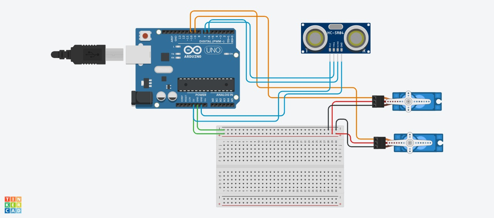

# Automatic-Railway-Gate-Control-System
An Arduino-based IoT project that automatically opens and closes railway gates using ultrasonic train detection and servo motor control, reducing human intervention and improving safety at railway crossings.

---

## 📌 Problem Statement

Manual railway gate operation can cause accidents due to human delay or error.  
This project automates gate control to improve safety at unmanned railway crossings.

---

## 🛠️ Tech Stack

**Hardware**
- Arduino UNO / Nano
- Ultrasonic Sensor (HC-SR04)
- Servo Motor
- Breadboard & Jumper Wires

**Software**
- C++ (Arduino)
- Arduino IDE

**Simulation**
- Tinkercad Circuits

---

## ⚙️ Working Principle

1. Ultrasonic sensor detects an approaching train
2. Distance is calculated in real time
3. If distance is below a threshold:
   - Gate closes using servo motor
4. After train passes:
   - Gate opens automatically

---

## 🧠 Core Logic

```cpp
if (distance < 20) {
  servo.write(90);   // Close gate
} else {
  servo.write(0);    // Open gate
}
```

---

## 🖼️ Circuit Diagram



---

## ✨ Features

- Automatic train detection
- Real-time distance calculation
- Servo-based gate automation
- Low-cost embedded solution
- Suitable for rural and unmanned crossings

---

## ⚠️ Limitations

- Single ultrasonic sensor
- No power backup
- No internet connectivity

---

## 🔮 Future Scope

- Dual-sensor detection
- IoT integration (ESP8266 / ESP32)
- GSM alerts
- Solar or battery backup
- Signal lights and warning systems

---

## ▶️ How to Run

1. Open Arduino IDE
2. Connect Arduino board
3. Upload the `.ino` file
4. Power the circuit
5. Test using a toy train or object

---

## 📄 License

This project is open for educational and learning purposes
